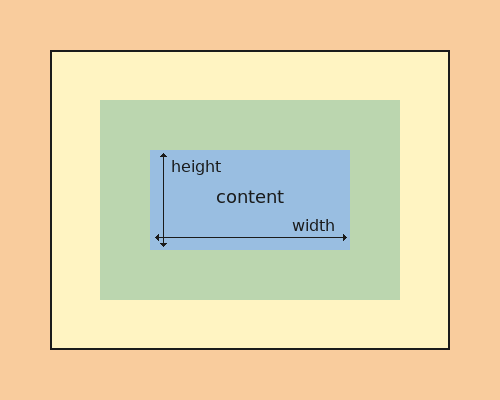
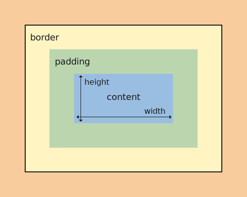
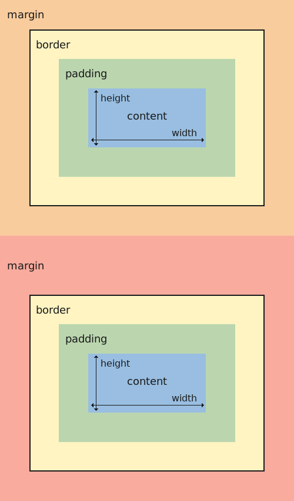

# Box areas
- In the CSS Box model, every HTML element is a box with four areas
	- the content: a header, paragraph, or image element  as an "object"
	- the padding: the space surrounding the content, as "bubble wrap"
	- the border: as "cardboard box" holding the item and bubble wrap 
	- the margin: the area outside of the box, and can be used to control the space between other boxes or elements. 
		- Here the bottom element has a larger top margin, pushing it further down the page.

# Resetting the default box model
- `box-sizing: border-box` changes how the total width and height of elements are calculated. 
- Here's what it does:
	- Without `box-sizing: border-box` (default behavior - called content-box):
		- If you set `width: 100px`
		- And add `padding: 10px` and `border: 5px`
		- The total width becomes `130px` (100px + 10px padding on each side + 5px border on each side)
	- With `box-sizing: border-box:`
		- If you set` width: 100px`
		- The element will stay `100px` wide TOTAL
		- Padding and border are included within that width
		- The content area automatically shrinks to accommodate padding and border
- e.g.
```css
/* Without border-box */
.box1 {
    width: 100px;
    padding: 10px;
    border: 5px solid black;
    /* Total width = 130px */
}

/* With border-box */
.box2 {
    box-sizing: border-box;
    width: 100px;
    padding: 10px;
    border: 5px solid black;
    /* Total width = 100px */
}
```